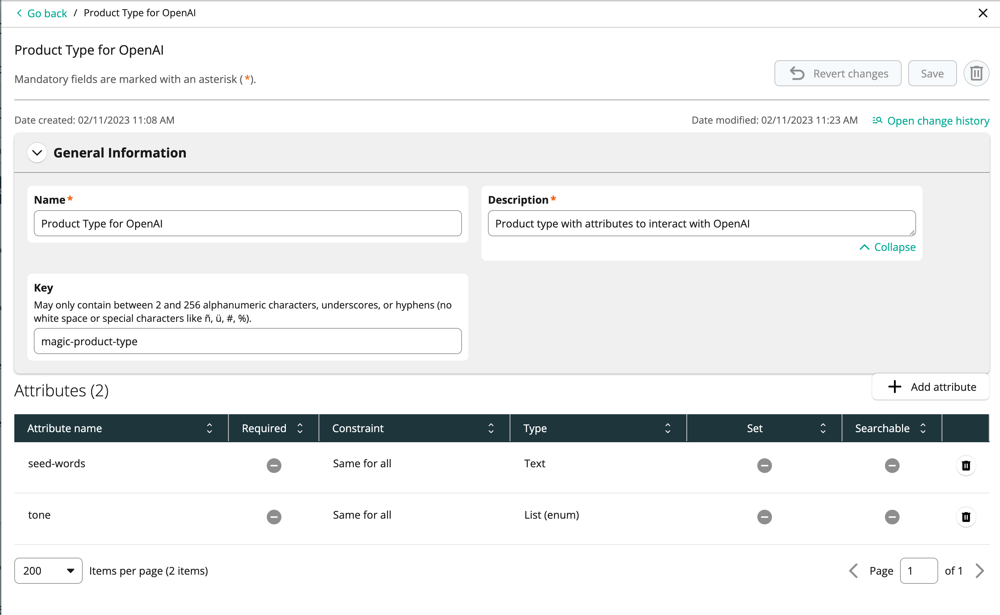
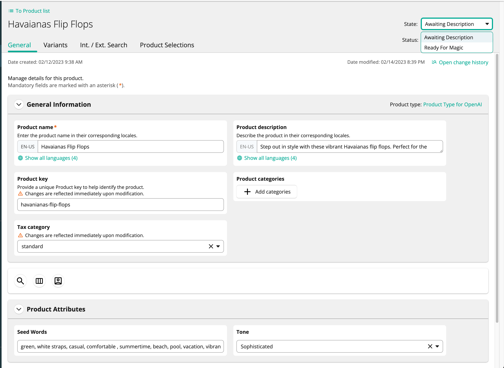

# commercetools Magic
Utilize OpenAI's APIs to dynamically create Product Descriptions in commercetools Composable Commerce.

https://user-images.githubusercontent.com/79161219/218758219-12ed0eb9-0ca3-4ee9-a846-2fcad39ce93e.mov


This repository contains all the necessary components to create and deploy a functioning example of integrating commercetools Composable Commerce with OpenAI. Including:
- commercetools configuration
  - Product Type (includes attributes to prompt OpenAI with keywords and tone for product description context)
  - Product States and Transitions (identify and automate products which are ready for a generated description)
  - Subscription (automates the call to the processing)
- Google Cloud components
  - Pub/Sub Topic and Subscription
  - Cloud Function

## How to use
Once deployed, the integration is automated with the native functionality of commercetools Merchant Center.



1. [Create a Product](https://docs.commercetools.com/merchant-center/product-list) with the `OpenAI Product Type`
2. Enter a Product Name, add comma-seperated descriptive words & terms in the 'Seed Words' attribute, select a 'Tone' from the options, and click 'Save'
3. Transition the State (in the top right corner) to 'Ready for Magic'
4. Wait 20-30 seconds for the Subscription to send the message to the topic, relay to the Cloud Function, and then to OpenAI and return with the description
5. Refresh the screen and review the AI generated 'Product Description'



## Requirements
- [commercetools Composable Commerce Project](https://docs.commercetools.com/getting-started/)
  - [API Client](https://docs.commercetools.com/getting-started/create-api-client) with manage_products scope (for app)
  - API Client with manage_project scope (for Terraform)
- [OpenAI API Key](https://help.openai.com/en/articles/4936850-where-do-i-find-my-secret-api-key)
- [nodejs 18](https://nodejs.org/en/download/)
- [gcloud tools](https://cloud.google.com/sdk/docs/install)
- [Terraform](https://developer.hashicorp.com/terraform/tutorials/aws-get-started/install-cli)
- [Google Cloud Account & Project](https://console.cloud.google.com/)


## Configuration
### Environment Variables
For Google Cloud Functions deployment set the environment variables in a .env.yaml (use .example.env.yaml as template)

The SEED_TEXT_EXPERT & SEED_TEXT_SOPHISTICATED can be modified to influence the response from OpenAI.

> Note: The CTP_PRODUCT_STATE_TRANSITION_ID needs to be set manually after the Terraform script creates the `product-description-updated` State.


### Terraform Secrets
Create a `secrets.tfvars` file in the `terraform/` directory and populate it with the following variables:
```
ct_client_id="<commercetools-api-client-id-with-manage-project-scope>"
ct_client_secret="<commercetools-secret-for-above-client>"
ct_project_key="<commercetools-project"
ct_scopes="manage_project:<commercetools-project>"
ct_api_url="<commercetools-api-url>"    #for example: "https://api.us-central1.gcp.commercetools.com"
ct_auth_url="<commercetools-auth-url>"  #for example: "https://auth.us-central1.gcp.commercetools.com"

gcp_project_id="<gcp-project>"
gcp_region="<gcp-region>  # for example: "us-central1"
```

## Deployment

### Apply Terraform 

In the `terraform/` directory, install the required modules by running:

```console
terraform init
```

To preview the execution [plan](https://www.terraform.io/docs/cli/commands/plan.html) using the values provided in the `secrets.tfvars` file, run:

```console
terraform plan -var-file secrets.tfvars
```

The plan outputs the operations that Terraform will attempt to perform. No changes have been made at this point.

To execute the operations, run the [`apply`](https://www.terraform.io/docs/cli/commands/apply.html) command. This will perform the operations on the resources that were outlined in the plan output. Enter `yes` when prompted to approve the changes.

```console
terraform apply -var-file secrets.tfvars
```

Terraform runs through the execution plan and creates/updates/deletes the remote resources. 

> **Add the id of the generated product-description-updated to the CTP_PRODUCT_STATE_TRANSITION_ID variable in the `.env.yaml` file.**

### Deploy Google Cloud Function

In the `app/` directory, run:
```console
npm install
```

```
gcloud functions deploy magic-description \
  --gen2 \
  --region=<your-gcp-region> \
  --runtime=nodejs18 \
  --entry-point=cloudEvent \
  --trigger-topic=product-state-transition \
  --env-vars-file=.env.yaml
```

gcloud will ask you to authenticate and enable the necessary APIs if applicable.
